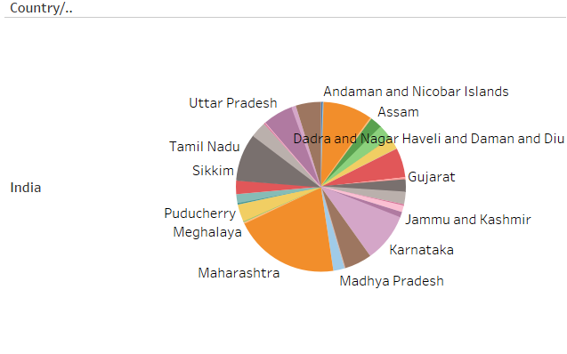
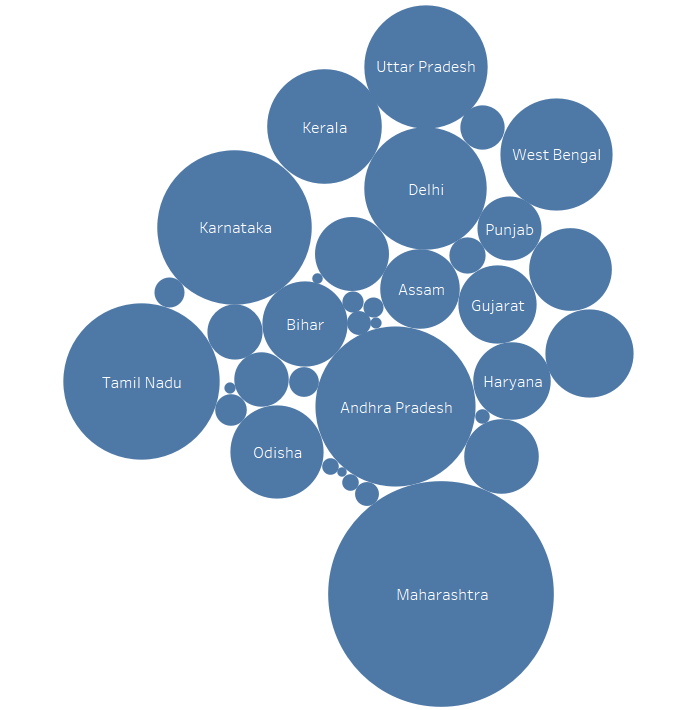
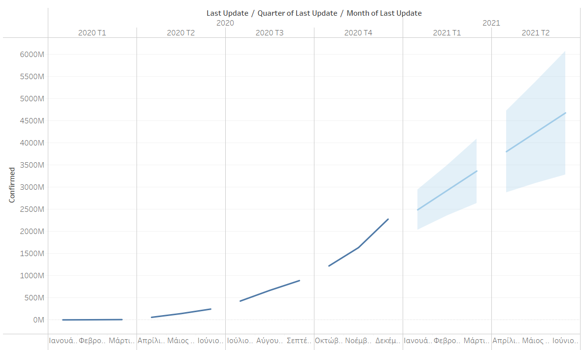
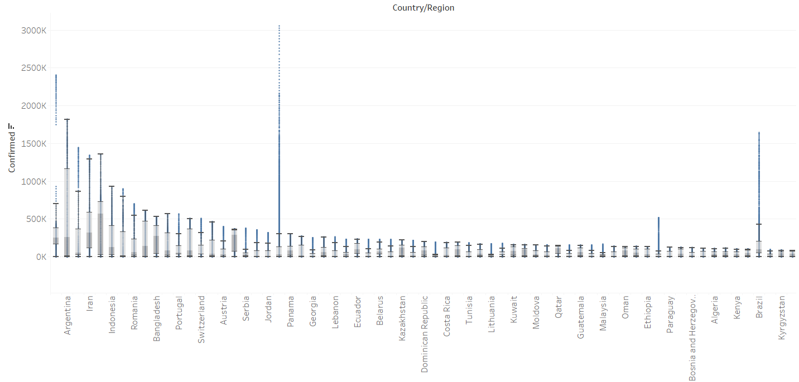
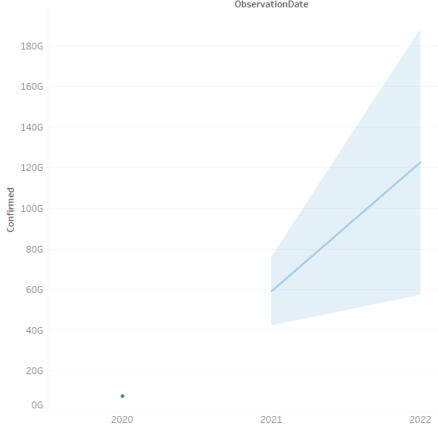
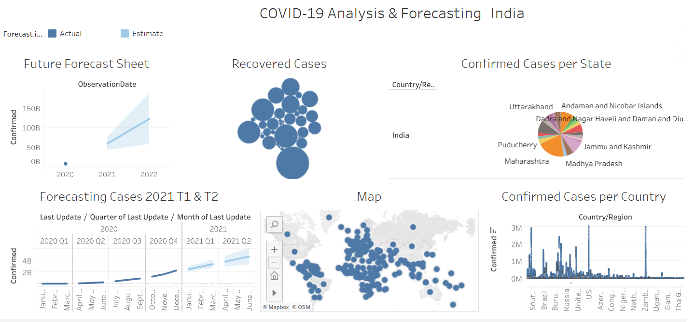

# 🦠 Tableau Project: COVID-19 Analysis & Forecasting

This project leverages Tableau to explore and visualize global and Indian COVID-19 data through maps, charts, forecasts and statistical plots. It provides insights into case distributions, recovery trends and predictive modeling.

---

## 📁 About the Dataset

This dataset contains **time-series data** related to the global spread of **COVID-19**, with a particular focus on **India**. Each record tracks confirmed cases, deaths and recoveries by country or state over time.

### 🧾 Dataset Columns:
- **SNo**: Serial number of the record  
- **ObservationDate**: Date when the data was recorded  
- **Province/State**: Specific state or region (especially within India)  
- **Country/Region**: Region name  
- **Last Update**: Timestamp of the latest update  
- **Confirmed**: Total confirmed COVID-19 cases  
- **Deaths**: Total COVID-19-related deaths  
- **Recovered**: Total number of recoveries  

---

## 🎯 Project Objectives

- Map and visualize the global and national spread of COVID-19
- Compare case severity by region
- Analyze recovery rates in India
- Forecast case growth using trendlines
- Explore distribution using advanced statistical plots

---

## 📊 Tasks & Visualizations

### 🗺️ **Task 1: Global Map of Confirmed Cases**

- A **filled map** (or symbol map) displaying **total confirmed cases** across different countries..
- Great for **geographic comparison** and visualizing COVID-19 spread.
  

---

### 🥧 **Task 2: Total Confirmed Cases in India (Pie Chart)**

- A **pie chart** visualizing the **distribution of confirmed cases** across Indian states.
- Clearly shows which states are most affected.

---

---

### 💚 **Task 3: Total Recovered Cases in India**

- A **bar or tree map** showing **total recovery counts** per Indian state.
- Helps evaluate state-wise recovery performance.
---

---
### 📈 **Task 4: Forecasting COVID-19 Cases (Trendline)**

- A **line chart** of confirmed cases over time with a **forecast trendline**.
- Built using **Tableau’s forecasting tool for 2021 T1 and T2 (exponential smoothing)**.
- 📌 *Important:* **Uncheck “Aggregate Measures”** to view daily data properly.

---

---
### 📦 **Task 5: Box & Whisker Plot by region**

- A **box-and-whisker plot** visualizing the **distribution of confirmed cases** by region.
- Use this to spot **outliers**, **medians**, and **interquartile ranges**.
- 📌 *Note:* Turn off **aggregate measures** for accurate distribution.

---

---
### 🔮 **Task 6: Future Forecast Sheet**

- A dedicated **forecasting sheet** projecting future confirmed cases and recoveries.
- Uses Tableau’s **built-in forecasting engine** based on historical trends.
- Helps in understanding potential future outbreak trajectories.

---
### 🔮 **Task 7: CLear Dashboard**
---

---

## 🛠️ Tools Used

- [**Tableau Desktop**](https://www.tableau.com/)
- 📊 COVID-19 time-series dataset (India + Global)
- 🧠 Tableau forecasting (exponential smoothing)
- 🌍 Mapping & statistical charting features

---

## 💡 Project Outcomes

This project demonstrates the ability to:

- Build interactive COVID-19 dashboards
- Apply forecasting to time-series health data
- Use advanced chart types like box plots and maps
- Communicate data insights through visual storytelling

---

## 🔗 Optional: View Dashboard Online

> [🔗 View Dashboard on Tableau Public](https://public.tableau.com/app/profile/konstantinos.kitsantas/viz/India_17091987624980/Dashboard1#1)
